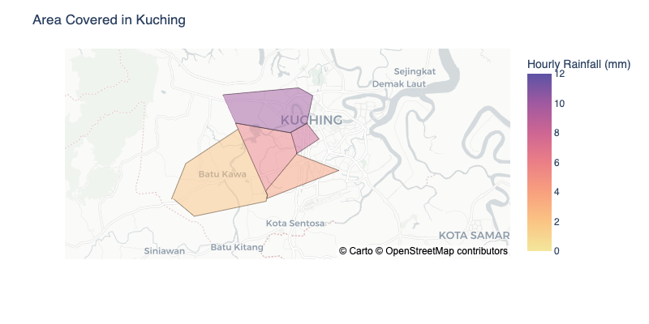
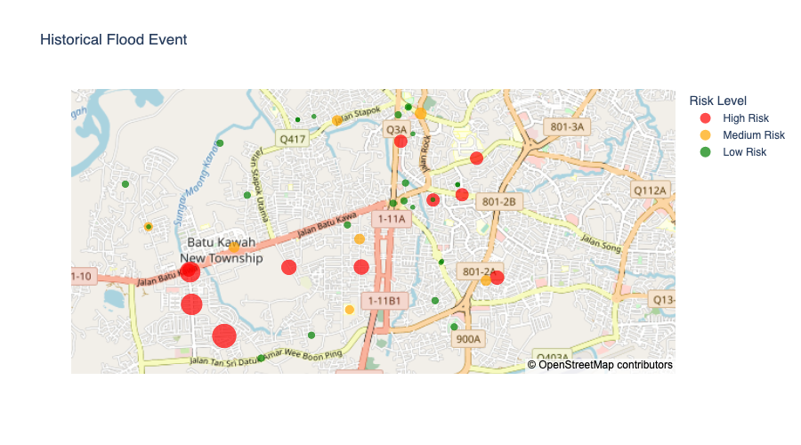

# 8th Edition Ocean Hackathon 2023 
## Challenge No.3 "Spatial and Temporal Visualization for Enhancing Climate Change Monitoring and Flood Management"

This repository is dedicated for the python code in visualising the historical rainfall pattern, spatial pattern and the flooding hotspot in Kuching city, Sarawak based on the data collected for decades from the Department of Irrigation and Drainage, Sarawak during Ocean Hackathon 2023. &#128187; The work are dedicated for challenge No.3, "Spatial and Temporal Visualization for Enhancing Climate Change Monitoring and Flood Management"

### Example of Visualisation from Rainfall_data.ipynb.

It can be visualised in term of hourly mean, daily mean as well as monthly mean based on the function selected in the notebook.

### Example of Visualisation from Polygon.ipynb

It visualises the spatial coverage of each station based on interpolation method, having a finer resolution as compared to conventional remote sensing (~10km x 10km)

### Example of Visualisation from Historial_flooding_event.ipynb

It visualises the flooding hotspot in Kuching town based on the historical data for the pass decades.

** Source of data can be accessed upon request.